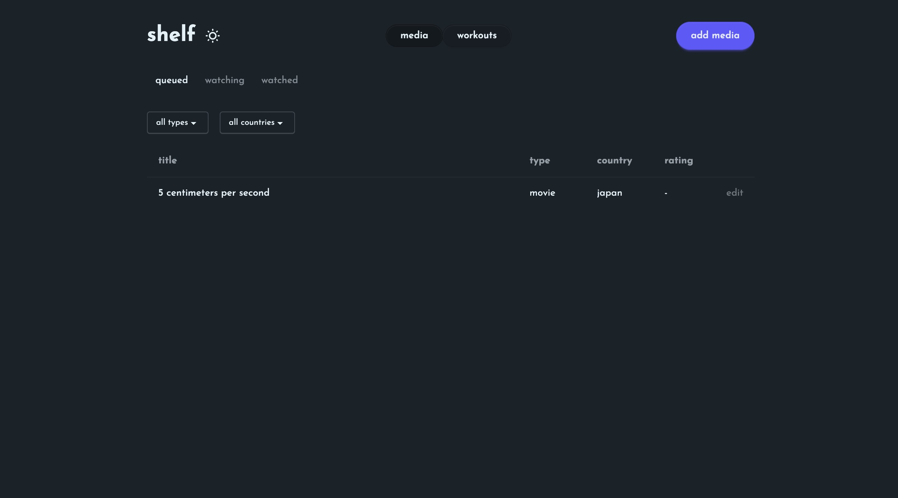
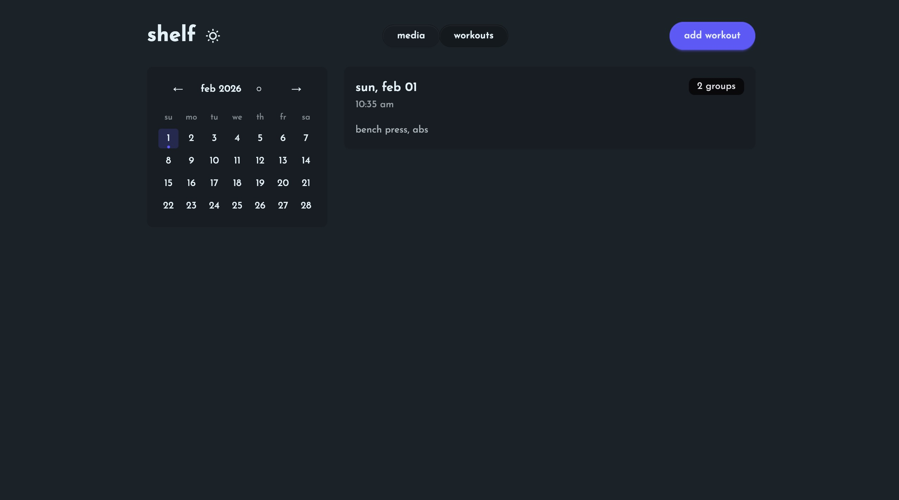

# shelf

a self-hosted, markdown-backed personal tracker for media (movies, shows, etc.)
and workouts

## screenshots

| media | workouts |
|-------|----------|
|  |  |

## features

- **media tracking**: track movies, shows, and other media with status
  (queued/watching/watched), ratings, and reviews
- **workout logging**: log workouts with exercise groups, sets, reps, and
  weights
- **workout templates**: save workout routines as templates for quick reuse
- **calendar view**: visual calendar showing workout days
- **markdown storage**: all data stored as markdown files with yaml frontmatter
  - easy to edit, backup, and version control
- **dark/light theme**: toggle between themes, preference saved locally

## requirements

- python 3.14+
- [uv](https://github.com/astral-sh/uv) (python package manager)
- node.js (for react frontend)

## setup

1. clone the repository:
   ```bash
   git clone <repo-url>
   cd shelf
   ```

2. install python dependencies:
   ```bash
   uv sync
   ```

3. install frontend dependencies:
   ```bash
   cd frontend && npm install
   ```

4. create content directories:
   ```bash
   mkdir -p contents/media contents/workout contents/templates
   ```

5. configure paths in `config.toml`:
   ```toml
   media_dir = "./contents/media"
   workout_dir = "./contents/workout"
   template_dir = "./contents/templates"
   ```

## running

development server (backend + frontend with hot reload):
```bash
make dev
```

production server:
```bash
make prod
```

in development, the frontend runs on `http://localhost:5173` and proxies API
calls to the backend on `http://localhost:8000`. in production, the built SPA is
served directly from fastapi on `http://localhost:80`.

## available commands

```bash
make help           # show all commands
make dev            # run both backend and frontend dev servers
make dev-api        # run fastapi backend only
make dev-ui         # run vite frontend only
make prod           # build frontend and run production server
make lint           # lint python (ruff) and typescript (tsc)
make format-all     # format python + frontend files
make build-frontend # build react app for production
```

## project structure

```
shelf/
├── app/
│   ├── main.py          # fastapi app, lifespan, parsing, cors, spa serving
│   ├── models.py        # data models (media, workout, templates)
│   ├── writer.py        # markdown serialization
│   └── routes/          # json api routes
│       ├── media.py
│       └── workout.py
├── frontend/            # react spa (vite + typescript)
│   ├── index.html
│   ├── package.json
│   ├── vite.config.ts
│   └── src/
│       ├── main.tsx
│       ├── App.tsx
│       ├── input.css    # tailwind + daisyui
│       ├── api/         # typed api client
│       ├── components/  # react components
│       ├── hooks/       # custom hooks
│       └── types/       # typescript interfaces
├── static/
│   ├── spa/             # vite build output (gitignored)
│   ├── favicons/
│   └── icons/
├── contents/            # markdown data (gitignored)
│   ├── media/
│   ├── workout/
│   └── templates/
├── config.toml          # directory configuration
├── pyproject.toml       # python dependencies
└── Makefile
```

## data format

### media item

```markdown
---
name: reply 1988
country: korea
type: drama
status: watched
rating: 5
---
optional review content here
```

### workout

```markdown
---
date: 2026-02-01
time: "09:30:00"
groups:
  - name: chest & triceps
    rest_seconds: 60
    exercises:
      - name: bench press
        sets:
          - reps: 10
            weight: 135
          - reps: 8
            weight: 155
---
optional notes here
```

## tech stack

- **backend**: fastapi (json api)
- **frontend**: react (vite) + tailwindcss + daisyui + tanstack query
- **data**: markdown with yaml frontmatter
- **tooling**: uv, ruff, prettier, typescript
