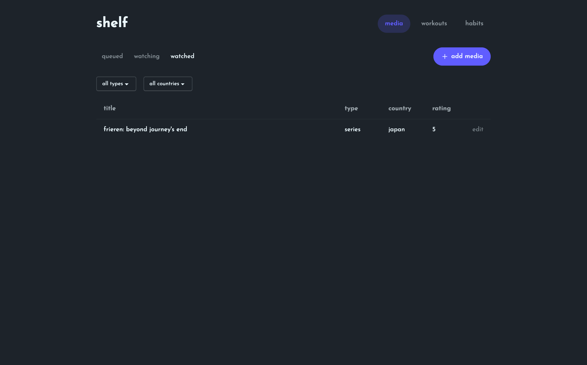
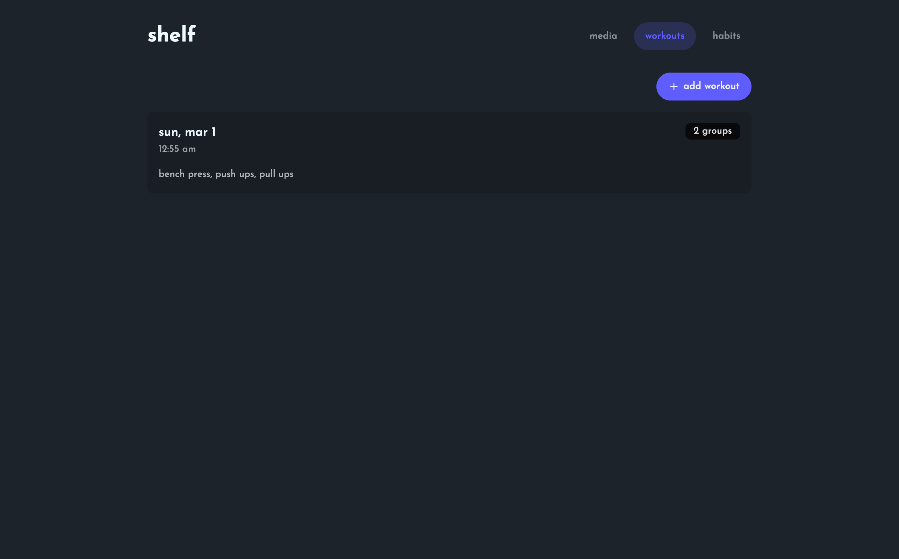
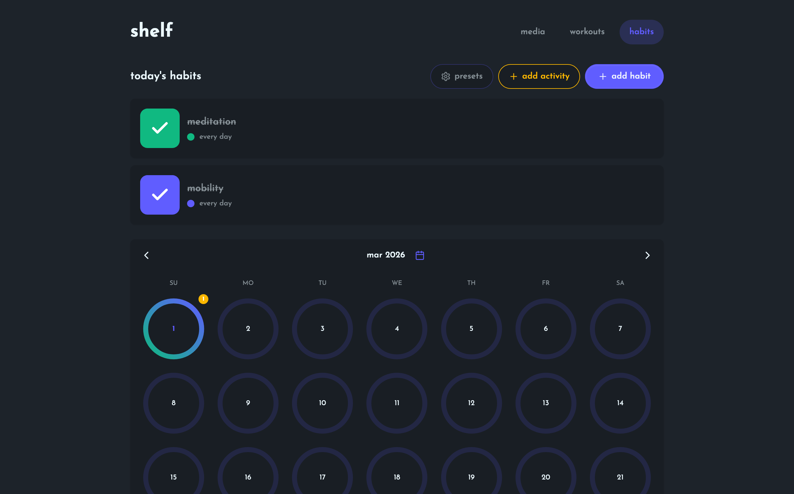
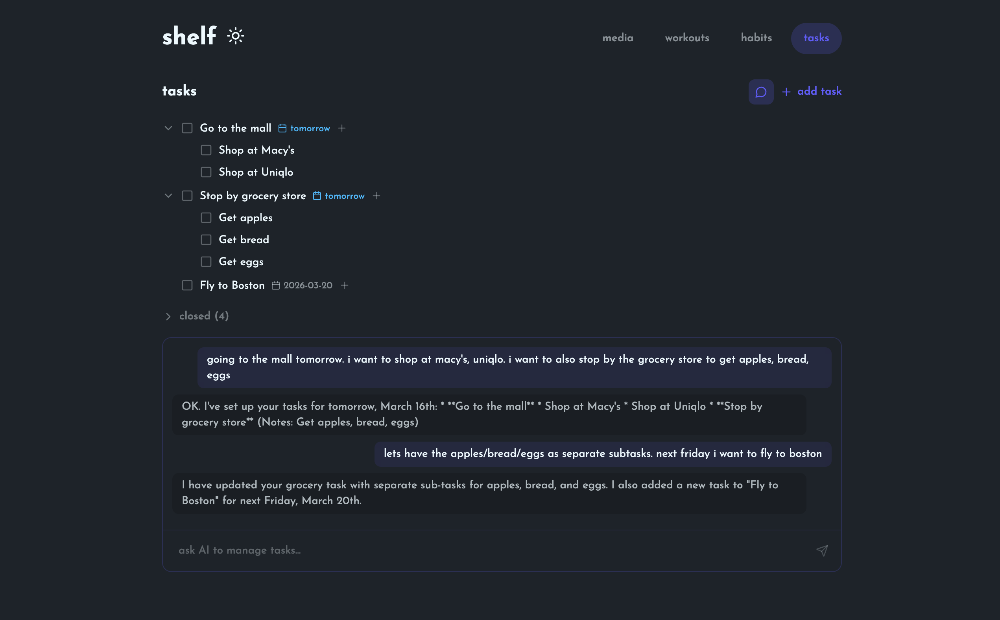

# shelf

a self-hosted, markdown-backed personal tracker for media, workouts, habits, and tasks

| media | workouts | habits | tasks |
|-------|----------|--------|-------|
|  |  |  |  |

## features

- **media tracking**: track movies, shows, and other media with status, ratings,
  and reviews
- **workout logging**: log workouts with exercise groups, sets, reps, and
  weights. drag-and-drop to reorder groups and exercises
- **workout templates**: save routines as templates for quick reuse
- **habit tracking**: track daily habits with completion history and a monthly
  calendar view
- **activity logging**: log one-off activities with preset quick-add
- **task management**: hierarchical tasks with drag-and-drop reordering and an
  optional ai chat assistant (powered by gemini)
- **markdown storage**: all data stored as plain markdown files with yaml
  frontmatter

## requirements

- python 3.14+
- [uv](https://github.com/astral-sh/uv)
- node.js

## setup

```bash
git clone <repo-url>
cd shelf
uv sync
cd frontend && npm install
```

configure paths in `config.toml` if needed — content directories are created
automatically on first run.

### environment variables

| variable | required | purpose |
|----------|----------|---------|
| `GEMINI_API_KEY` | no | enables ai chat in the tasks section. if not set, the app starts normally but the chat endpoint returns 503 |
| `GEMINI_MODEL` | no | override the gemini model used for chat (defaults to `gemini-3-flash-preview`) |

## running

```bash
make dev     # backend + frontend dev servers (hot reload)
make prod    # build frontend and serve from fastapi
```

dev: frontend at `http://localhost:5173`, api at `http://localhost:8000`
prod: everything at `http://localhost:80`

## commands

```bash
make dev            # run both servers
make dev-api        # backend only
make dev-ui         # frontend only
make lint           # ruff + tsc
make format-all     # ruff + prettier
make build-frontend # production build
```

## tech stack

- **backend**: fastapi + python-frontmatter
- **frontend**: react + vite + tailwindcss + daisyui + tanstack query
- **data**: markdown with yaml frontmatter
- **tooling**: uv, ruff, prettier, typescript
